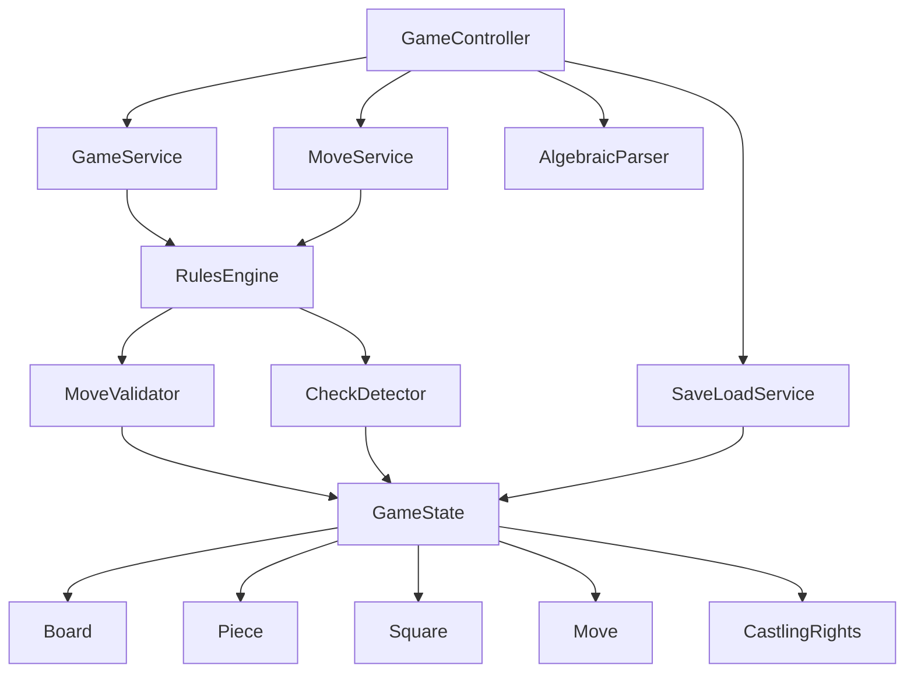

# Console Chess

A Java console-based chess game built with Maven, implementing complete chess rules including castling, en passant, pawn promotion, check/checkmate/stalemate detection, and game state persistence.

## Features

- Full chess rule implementation: castling, en passant, pawn promotion
- Check, checkmate, and stalemate detection
- Domain-driven design with layered architecture:
  - Domain models (Board, Piece, GameState)
  - Rules engine (MoveValidator, CheckDetector)
  - Services (GameService, MoveService)
  - Parser (AlgebraicParser)
  - Persistence (SaveLoadService)
- Human-vs-human play with command-line input
- Legal move listing ("pip" command)
- Save/load game state to/from text files
- Comprehensive JUnit test suite

## Prerequisites

- Java 8 or higher
- Maven 3.x

## Building and Running

1. Clone the repository:
   ```bash
   git clone <repository-url>
   cd console-chess
   ```

2. Build the project:
   ```bash
   mvn clean compile
   ```

3. Run the game:
   ```bash
   mvn exec:java -Dexec.mainClass="com.chess.controller.GameController"
   ```

Alternatively, after building:
```bash
java -cp target/classes com.chess.controller.GameController
```

## How to Play

- Enter player names when prompted.
- Enter moves in long algebraic notation (e.g., `e2e4` for pawn to e4, `e7e8q` for promotion to queen).
- Special commands:
  - `pip`: List all legal moves for the current player.
  - `save <filename>`: Save the current game state.
  - `load <filename>`: Load a saved game.
  - `hint`: Show help.
  - `q`: Quit the game.

## Architecture



## Project Structure

- `src/main/java/com/chess/`: Source code
  - `domain/`: Core domain models
  - `rules/`: Chess rule validation and move generation
  - `service/`: Business logic services
  - `parser/`: Input parsing
  - `persist/`: Game state serialization
  - `controller/`: Main application controller
- `src/test/java/`: Unit tests
- `pom.xml`: Maven configuration

## Testing

Run the test suite:
```bash
mvn test
```

## Contributing

This project is a learning exercise in chess algorithms and clean Java code. Feel free to fork and extend with features like AI opponents or a GUI.

## License

[Add your license here, e.g., MIT]
